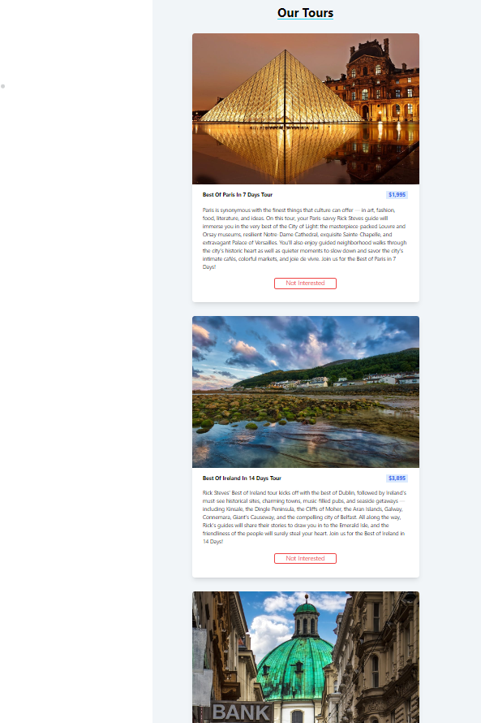

# Tours

## Table of Contents
* [Overview](#overview)
* [Project Screenshot](#screenshots)
* [Installation](#installation)
* [Reflection](#reflection)
* [References](#references)
* [Author](#author)

# Overview
An application showcasing tour plans for well known cities and countries.

## Screenshots
 

### You can watch Live demo [_here_](https://tours-brown.vercel.app/).

## Installation

Clone down this repository. You will need `node` and `npm` installed globally on your machine.  

Installation:

`npm install`  

To Start Server:

`npm start`  

To Visit App:

`localhost:3000`  

## Reflection

This was a 1 day project built while learning react. 

The technologies implemented in this project are React and TailwindCSS. I chose to use the `create-react-app` boilerplate to minimize initial setup and invest more time in diving into weird technological rabbit holes. 

## References
- [TailwindCSS](https://tailwindcss.com/)
- [React](https://reactjs.org/docs/getting-started.html)

## Author

[Website](https://kedarmakode.com/)

[Linkedin](https://www.linkedin.com/in/kedar-makode-9833321ab)

[Twitter](https://twitter.com/Kedar__98)

[Instagram]()

kedarmakode1598@gmail.com

